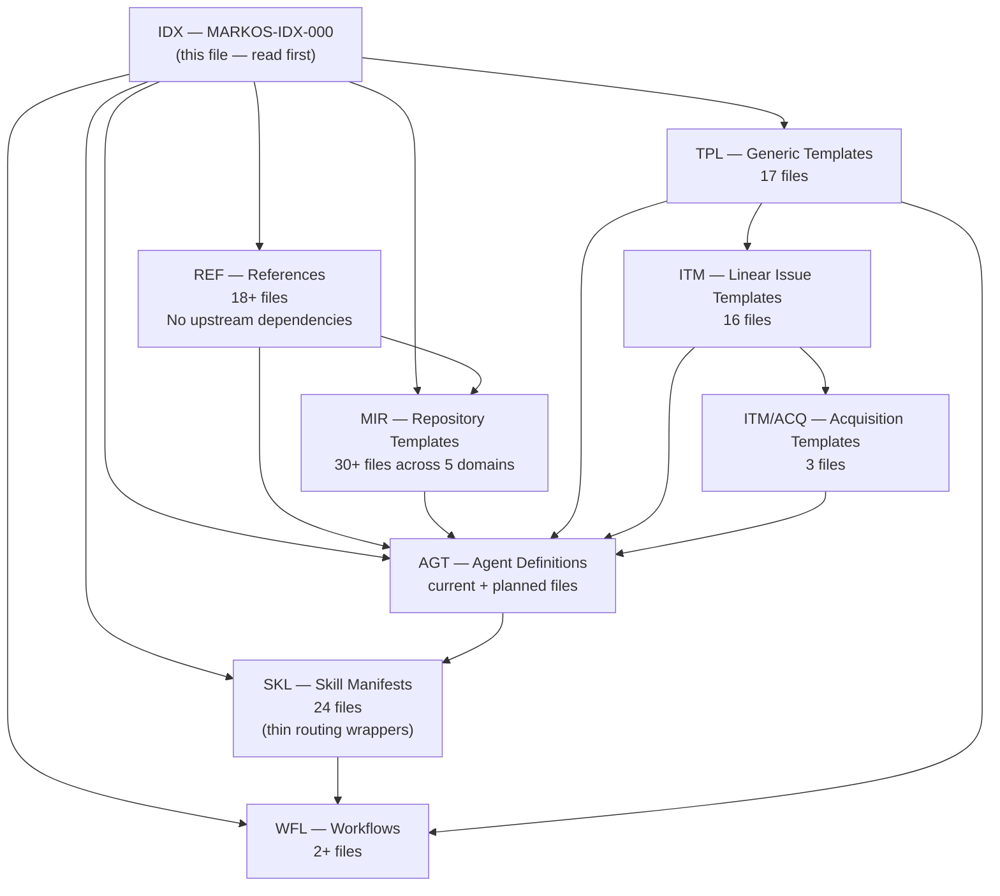

# MarkOS Master Document Index

## [AGENT] How to Use This Index

> [!IMPORTANT]
> **AGENT BOOT SEQUENCE**: Read `.protocol-lore/QUICKSTART.md` first. This file (`MARKOS-IDX-000`) is the mandatory *second* read.

This file is `MARKOS-IDX-000`. It is the mandatory entry point for technical domain mapping within `.agent/markos/`. Every Token_ID in the corpus is registered here. When a document references another by Token_ID, resolve the path from the `File` column below.

**Path column:** Paths are relative to **this directory** (`.agent/markos/`) except **SKL** skill manifests (**`../skills/...`** → `.agent/skills/`) and **PRM** execution prompts (**`../prompts/...`** → `.agent/prompts/`). AGT, WFL, TPL, ITM, MIR, and REF entries live under `.agent/markos/` as written.

**TOKEN_ID structure:** `MARKOS-[CLASS]-[DOMAIN]-[SEQ]`
- CLASS: `AGT` agent · `PRM` prompt · `REF` reference · `SKL` skill · `MIR` MIR template · `MSP` MSP matrix · `WFL` workflow · `TPL` generic template · `IDX` index
- DOMAIN: `NEU` neuromarketing · `STR` strategy · `EXE` execution · `ANA` analytics · `OPS` operations · `TRK` tracking · `CNT` content · `AUD` audience · `CAM` campaign · `PRC` pricing · `SAS` SaaS suite
- SEQ: zero-padded 2-digit integer, unique within CLASS+DOMAIN

---

## Document Registry

### Class: IDX (Index)

| TOKEN_ID | File Path | Class | Domain | Description |
|----------|-----------|-------|--------|-------------|
| MARKOS-IDX-000 | `MARKOS-INDEX.md` | IDX | OPS | This file. Master entry point for all autonomous agents. |

---

### Class: REF (Reference Documents)

| TOKEN_ID | File Path | Class | Domain | Description |
|----------|-----------|-------|--------|-------------|
| MARKOS-REF-NEU-01 | `references/neuromarketing.md` | REF | NEU | B01–B10 biological trigger catalog, archetype→ICP map, funnel stage→trigger assignments, `<neuro_spec>` block schema |
| MARKOS-REF-OPS-01 | `references/mir-gates.md` | REF | OPS | Gate 1 (Identity) and Gate 2 (Execution) file requirements, check logic, agent enforcement table |
| MARKOS-REF-OPS-02 | `references/marketing-living-system.md` | REF | OPS | Protocol-level audit, cross-protocol gap register (GAP-01–GAP-07), enhancement roadmap |
| MARKOS-REF-OPS-03 | `references/verification-patterns.md` | REF | OPS | Standard verification patterns used by verifier and checker agents |
| MARKOS-REF-OPS-04 | `references/questioning.md` | REF | OPS | Adaptive questioning protocol used by discuss-phase skill |
| MARKOS-REF-OPS-05 | `references/planning-config.md` | REF | OPS | .planning/config.json schema and field definitions |
| MARKOS-REF-OPS-06 | `references/continuation-format.md` | REF | OPS | Resume/continuation handoff format standard |
| MARKOS-REF-OPS-07 | `references/checkpoints.md` | REF | OPS | Checkpoint pattern for mid-phase human handoff |
| MARKOS-REF-OPS-08 | `references/user-profiling.md` | REF | OPS | User behavioral profile schema |
| MARKOS-REF-OPS-09 | `references/model-profiles.md` | REF | OPS | Model profile definitions (quality/balanced/budget/inherit) |
| MARKOS-REF-OPS-10 | `references/model-profile-resolution.md` | REF | OPS | Profile resolution logic for agent invocation |
| MARKOS-REF-OPS-11 | `references/decimal-phase-calculation.md` | REF | OPS | Decimal phase numbering algorithm (e.g., 2.1 between phase 2 and 3) |
| MARKOS-REF-OPS-12 | `references/phase-argument-parsing.md` | REF | OPS | Argument parsing rules for phase-targeting skills |
| MARKOS-REF-OPS-13 | `references/git-integration.md` | REF | OPS | Git commit patterns, branch strategy for MarkOS |
| MARKOS-REF-OPS-14 | `references/git-planning-commit.md` | REF | OPS | .planning/ directory commit conventions |
| MARKOS-REF-CNT-01 | `references/ui-brand.md` | REF | CNT | UI brand guidelines for MarkOS output formatting |
| MARKOS-REF-PRC-01 | `references/pricing-engine.md` | REF | PRC | Pricing Engine protocol doctrine, PRC target agents, placeholder policy, and approval rules |
| MARKOS-REF-SAS-01 | `references/saas-suite.md` | REF | SAS | SaaS Suite tenant-type doctrine, SAS target agents, subscription/billing/compliance/support/revenue requirements |

---

### Class: AGT (Agent Definitions)

| TOKEN_ID | File Path | Class | Domain | Description |
|----------|-----------|-------|--------|-------------|
| MARKOS-AGT-STR-01 | `agents/markos-strategist.md` | AGT | STR | MIR architect; enforces Gate 1/2 before strategy; neuro trigger architecture |
| MARKOS-AGT-STR-02 | `agents/markos-planner.md` | AGT | STR | Creates PLAN.md from MIR context + MSP matrix |
| MARKOS-AGT-STR-03 | `agents/markos-campaign-architect.md` | AGT | STR | Campaign structure design; channel selection |
| MARKOS-AGT-STR-04 | `agents/markos-creative-brief.md` | AGT | STR | Creative brief generation from MIR foundation |
| MARKOS-AGT-STR-05 | `agents/markos-cro-hypothesis.md` | AGT | STR | Conversion rate optimization hypothesis generation |
| MARKOS-AGT-NEU-01 | `agents/markos-neuro-auditor.md` | AGT | NEU | 8-dimension neuromarketing audit of plans; returns PASSED/WARNINGS/REWRITE REQUIRED |
| MARKOS-AGT-EXE-01 | `agents/markos-executor.md` | AGT | EXE | Executes all tasks in a PLAN.md; atomic commits; creates SUMMARY.md |
| MARKOS-AGT-EXE-02 | `agents/markos-verifier.md` | AGT | EXE | 7-dimension post-phase verification; creates VERIFICATION.md |
| MARKOS-AGT-EXE-03 | `agents/markos-plan-checker.md` | AGT | EXE | Pre-execution plan quality gate; validates plan structure and completeness |
| MARKOS-AGT-CNT-01 | `agents/markos-content-creator.md` | AGT | CNT | Channel-formatted content generation; enforces VOICE-TONE constraints |
| MARKOS-AGT-CNT-02 | `agents/markos-copy-drafter.md` | AGT | CNT | Long-form and short-form copy drafting |
| MARKOS-AGT-CNT-03 | `agents/markos-social-drafter.md` | AGT | CNT | Social media post drafting per channel format |
| MARKOS-AGT-CNT-04 | `agents/markos-email-sequence.md` | AGT | CNT | Email sequence generation with trigger-based logic |
| MARKOS-AGT-CNT-05 | `agents/markos-content-brief.md` | AGT | CNT | Content brief creation from campaign objectives |
| MARKOS-AGT-CNT-06 | `agents/markos-seo-planner.md` | AGT | CNT | SEO keyword strategy and content cluster planning |
| MARKOS-AGT-AUD-01 | `agents/markos-audience-intel.md` | AGT | AUD | Monthly ICP behavioral signal extraction from public data |
| MARKOS-AGT-AUD-02 | `agents/markos-market-researcher.md` | AGT | AUD | Market research; competitor positioning; demand signals |
| MARKOS-AGT-AUD-03 | `agents/markos-competitive-monitor.md` | AGT | AUD | Ongoing competitor campaign and messaging monitoring |
| MARKOS-AGT-AUD-04 | `agents/markos-market-scanner.md` | AGT | AUD | Emerging opportunity detection in target market |
| MARKOS-AGT-ANA-01 | `agents/markos-funnel-analyst.md` | AGT | ANA | Funnel stage conversion analysis |
| MARKOS-AGT-ANA-02 | `agents/markos-performance-monitor.md` | AGT | ANA | Campaign KPI monitoring against targets |
| MARKOS-AGT-ANA-03 | `agents/markos-gap-auditor.md` | AGT | ANA | MIR gap detection; surfaces incomplete or stale files |
| MARKOS-AGT-ANA-04 | `agents/markos-report-compiler.md` | AGT | ANA | Compiles analytics data into structured performance reports |
| MARKOS-AGT-TRK-01 | `agents/markos-tracking-spec.md` | AGT | TRK | PostHog event schema, pixel IDs, conversion event definitions |
| MARKOS-AGT-TRK-02 | `agents/markos-utm-architect.md` | AGT | TRK | UTM taxonomy design and parameter standards |
| MARKOS-AGT-OPS-01 | `agents/markos-context-loader.md` | AGT | OPS | Loads and validates project context at session start |
| MARKOS-AGT-OPS-02 | `agents/markos-librarian.md` | AGT | OPS | MIR file staleness tracking and catalogue maintenance |
| MARKOS-AGT-OPS-03 | `agents/markos-automation-architect.md` | AGT | OPS | n8n/automation workflow design |
| MARKOS-AGT-OPS-04 | `agents/markos-calendar-builder.md` | AGT | OPS | Campaign calendar generation from MSP matrices |
| MARKOS-AGT-OPS-05 | `agents/markos-budget-monitor.md` | AGT | OPS | Budget threshold monitoring; escalation on overspend |
| MARKOS-AGT-OPS-06 | `agents/markos-lead-scorer.md` | AGT | OPS | Lead scoring model definition |
| MARKOS-AGT-OPS-07 | `agents/markos-linear-manager.md` | AGT | OPS | Linear.app ticket creation and bidirectional sync |
| MARKOS-AGT-RES-01 | `agents/markos-researcher.md` | AGT | RES | Market Intelligence Agent — populates RESEARCH/ files from onboarding seed |
| MARKOS-AGT-ONB-01 | `agents/markos-onboarder.md` | AGT | ONB | Onboarding Orchestrator — reads seed, drives researcher, scaffolds MIR/MSP |
| MARKOS-AGT-SAS-01 | `agents/markos-saas-subscription-lifecycle-manager.md` | AGT | SAS | Planned SaaS Suite agent for subscription lifecycle state, renewals, cancellations, and approval-gated mutations |
| MARKOS-AGT-SAS-02 | `agents/markos-saas-revenue-intelligence-analyst.md` | AGT | SAS | Planned SaaS Suite agent for MRR, ARR, NRR, GRR, churn, expansion, forecast, and revenue waterfall intelligence |
| MARKOS-AGT-SAS-03 | `agents/markos-saas-billing-compliance-agent.md` | AGT | SAS | Planned SaaS Suite agent for invoice compliance, DIAN/US billing checks, accounting sync, and billing exception tasks |
| MARKOS-AGT-SAS-04 | `agents/markos-saas-churn-risk-assessor.md` | AGT | SAS | Planned SaaS Suite agent for health scoring, churn-risk alerts, and intervention playbooks |
| MARKOS-AGT-SAS-05 | `agents/markos-saas-support-intelligence-agent.md` | AGT | SAS | Planned SaaS Suite agent for support ticket triage, grounded suggested responses, and CS approval routing |
| MARKOS-AGT-SAS-06 | `agents/markos-saas-expansion-revenue-scout.md` | AGT | SAS | Planned SaaS Suite agent for upgrade, add-seat, expansion, and cross-sell opportunity discovery |
| MARKOS-PRM-OPS-01 | `../prompts/telemetry_synthesizer.md` | PRM | OPS | Layer 0 Data Analyst; converts raw analytics into MIR insights |
| MARKOS-PRM-STR-01 | `../prompts/cro_landing_page_builder.md` | PRM | STR | High-conversion wireframer and copywriter for owned properties |
| MARKOS-PRM-EXE-01 | `../prompts/paid_media_creator.md` | PRM | EXE | Performance media creator (Meta/Google Ad copy) |
| MARKOS-PRM-CNT-01 | `../prompts/email_lifecycle_strategist.md` | PRM | CNT | Retention and LTV-focused email strategist |
| MARKOS-PRM-CNT-02 | `../prompts/seo_content_architect.md` | PRM | CNT | Inbound content creator focused on long-tail dominance |
| MARKOS-PRM-CNT-03 | `../prompts/social_community_manager.md` | PRM | CNT | Organic social engagement and market polarization |
| MARKOS-PRM-OPS-02 | `../prompts/brand_enforcer_qa.md` | PRM | OPS | Ruthless gatekeeper for brand and legal compliance |

---

### Class: SKL (Skill Manifests)

| TOKEN_ID | File Path | Class | Domain | Description |
|----------|-----------|-------|--------|-------------|
| MARKOS-SKL-NEU-01 | `../skills/markos-neuro-auditor/SKILL.md` | SKL | NEU | Routes to MARKOS-AGT-NEU-01 |
| MARKOS-SKL-OPS-01 | `../skills/markos-plan-phase/SKILL.md` | SKL | OPS | Routes to MARKOS-AGT-STR-02 (planner) |
| MARKOS-SKL-OPS-02 | `../skills/markos-execute-phase/SKILL.md` | SKL | OPS | Routes to MARKOS-AGT-EXE-01 (executor) |
| MARKOS-SKL-OPS-03 | `../skills/markos-discuss-phase/SKILL.md` | SKL | OPS | Routes to discuss-phase workflow |
| MARKOS-SKL-OPS-04 | `../skills/markos-verify-work/SKILL.md` | SKL | OPS | Routes to MARKOS-AGT-EXE-02 (verifier) |
| MARKOS-SKL-OPS-05 | `../skills/markos-progress/SKILL.md` | SKL | OPS | Routes to progress dashboard workflow |
| MARKOS-SKL-OPS-06 | `../skills/markos-health/SKILL.md` | SKL | OPS | Routes to structural health check |
| MARKOS-SKL-OPS-07 | `../skills/markos-autonomous/SKILL.md` | SKL | OPS | Routes to autonomous multi-phase execution orchestrator |
| MARKOS-SKL-OPS-08 | `../skills/markos-new-milestone/SKILL.md` | SKL | OPS | Routes to new milestone initialization |
| MARKOS-SKL-OPS-09 | `../skills/markos-complete-milestone/SKILL.md` | SKL | OPS | Routes to milestone archival workflow |
| MARKOS-SKL-OPS-10 | `../skills/markos-audit-milestone/SKILL.md` | SKL | OPS | Routes to milestone audit against KPIs |
| MARKOS-SKL-OPS-11 | `../skills/markos-insert-phase/SKILL.md` | SKL | OPS | Routes to decimal phase insertion logic |
| MARKOS-SKL-OPS-12 | `../skills/markos-remove-phase/SKILL.md` | SKL | OPS | Routes to phase removal and renumbering |
| MARKOS-SKL-OPS-13 | `../skills/markos-pause-work/SKILL.md` | SKL | OPS | Routes to context handoff creation |
| MARKOS-SKL-OPS-14 | `../skills/markos-resume-work/SKILL.md` | SKL | OPS | Routes to session context restoration |
| MARKOS-SKL-OPS-15 | `../skills/markos-session-report/SKILL.md` | SKL | OPS | Routes to session report generation |
| MARKOS-SKL-OPS-16 | `../skills/markos-stats/SKILL.md` | SKL | OPS | Routes to project statistics dashboard |
| MARKOS-SKL-OPS-17 | `../skills/markos-help/SKILL.md` | SKL | OPS | Routes to MARKOS command reference |
| MARKOS-SKL-OPS-18 | `../skills/markos-discipline-activate/SKILL.md` | SKL | OPS | Routes to MSP discipline toggle |
| MARKOS-SKL-OPS-19 | `../skills/markos-linear-sync/SKILL.md` | SKL | OPS | Routes to MARKOS-AGT-OPS-07 (linear-manager) |
| MARKOS-SKL-CAM-01 | `../skills/markos-campaign-launch/SKILL.md` | SKL | CAM | Routes to campaign launch checklist |
| MARKOS-SKL-CAM-02 | `../skills/markos-performance-review/SKILL.md` | SKL | CAM | Routes to campaign performance analysis |
| MARKOS-SKL-CAM-03 | `../skills/markos-mir-audit/SKILL.md` | SKL | CAM | Routes to MIR completeness audit |
| MARKOS-SKL-ANA-01 | `../skills/markos-research-phase/SKILL.md` | SKL | ANA | Routes to standalone market research |

---

### Class: WFL (Workflows)

| TOKEN_ID | File Path | Class | Domain | Description |
|----------|-----------|-------|--------|-------------|
| MARKOS-WFL-OPS-01 | `workflows/complete-milestone.md` | WFL | OPS | Milestone archival and next-cycle preparation |
| MARKOS-WFL-OPS-02 | `workflows/linear-sync.md` | WFL | OPS | Linear.app bidirectional sync execution |

---

### Class: TPL (Generic Templates)

| TOKEN_ID | File Path | Class | Domain | Description |
|----------|-----------|-------|--------|-------------|
| MARKOS-TPL-NEU-01 | `templates/NEURO-BRIEF.md` | TPL | NEU | Campaign neuromarketing brief scaffold |
| MARKOS-TPL-OPS-01 | `templates/UAT.md` | TPL | OPS | User acceptance testing criteria template |
| MARKOS-TPL-OPS-02 | `templates/VALIDATION.md` | TPL | OPS | Phase validation report template |
| MARKOS-TPL-OPS-03 | `templates/campaign-brief.md` | TPL | CAM | Campaign brief scaffold |
| MARKOS-TPL-OPS-04 | `templates/context.md` | TPL | OPS | Context loader template |
| MARKOS-TPL-OPS-05 | `templates/continue-here.md` | TPL | OPS | Session continuation handoff template |
| MARKOS-TPL-OPS-06 | `templates/creative-brief.md` | TPL | CNT | Creative brief template |
| MARKOS-TPL-OPS-07 | `templates/project.md` | TPL | OPS | PROJECT.md scaffold |
| MARKOS-TPL-OPS-08 | `templates/requirements.md` | TPL | OPS | REQUIREMENTS.md scaffold |
| MARKOS-TPL-OPS-09 | `templates/retrospective.md` | TPL | OPS | Phase retrospective template |
| MARKOS-TPL-OPS-10 | `templates/roadmap.md` | TPL | OPS | ROADMAP.md scaffold |
| MARKOS-TPL-OPS-11 | `templates/state.md` | TPL | OPS | STATE.md scaffold |
| MARKOS-TPL-OPS-12 | `templates/summary.md` | TPL | OPS | Phase SUMMARY.md scaffold |
| MARKOS-TPL-OPS-13 | `templates/summary-complex.md` | TPL | OPS | Complex phase summary scaffold |
| MARKOS-TPL-OPS-14 | `templates/summary-minimal.md` | TPL | OPS | Minimal phase summary scaffold |
| MARKOS-TPL-OPS-15 | `templates/verification-report.md` | TPL | OPS | VERIFICATION.md output template |
| MARKOS-TPL-OPS-16 | `templates/LINEAR-TASKS/_SCHEMA.md` | TPL | OPS | Linear issue template schema; canonical markdown structure for all MARKOS-ITM files |

---

### Class: ITM (Linear Issue Templates)

| TOKEN_ID | File Path | Class | Domain | Description |
|----------|-----------|-------|--------|-------------|
| MARKOS-ITM-CNT-01 | `templates/LINEAR-TASKS/MARKOS-ITM-CNT-01-lead-magnet.md` | ITM | CNT | Lead Magnet Design — triggers B04/B05/B07; Gate 1 |
| MARKOS-ITM-CNT-02 | `templates/LINEAR-TASKS/MARKOS-ITM-CNT-02-ad-copy.md` | ITM | CNT | Ad Copywriting (Paid Media) — triggers B02/B05/B06/B09; Gate 1+2 |
| MARKOS-ITM-CNT-03 | `templates/LINEAR-TASKS/MARKOS-ITM-CNT-03-email-sequence.md` | ITM | CNT | Email Sequence — triggers B01/B02/B03/B07; Gate 1 |
| MARKOS-ITM-STR-01 | `templates/LINEAR-TASKS/MARKOS-ITM-STR-01-audience-research.md` | ITM | STR | Audience Research & ICP Update — trigger B08; no gate (populates Gate 1) |
| MARKOS-ITM-STR-02 | `templates/LINEAR-TASKS/MARKOS-ITM-STR-02-funnel-architecture.md` | ITM | STR | Funnel Architecture & Channel Plan — triggers B02/B05/B06/B09; Gate 1+2 |
| MARKOS-ITM-TRK-01 | `templates/LINEAR-TASKS/MARKOS-ITM-TRK-01-utm-tracking.md` | ITM | TRK | UTM Architecture & Tracking Setup — operational; Gate 2 |
| MARKOS-ITM-ANA-01 | `templates/LINEAR-TASKS/MARKOS-ITM-ANA-01-performance-review.md` | ITM | ANA | Campaign Performance Review — trigger-failure diagnostic; Gate 2 |
| MARKOS-ITM-OPS-01 | `templates/LINEAR-TASKS/MARKOS-ITM-OPS-01-campaign-launch.md` | ITM | OPS | Campaign Launch Checklist — Go/No-Go gate enforcement; Gate 1+2 hard block |
| MARKOS-ITM-CNT-04 | `templates/LINEAR-TASKS/MARKOS-ITM-CNT-04-social-calendar.md` | ITM | CNT | Social Media Content Calendar — triggers B01/B03/B07/B08; Gate 1 |
| MARKOS-ITM-CNT-05 | `templates/LINEAR-TASKS/MARKOS-ITM-CNT-05-landing-page-copy.md` | ITM | CNT | Landing Page Copy — triggers B02/B03/B04/B05/B06/B09; Gate 1 |
| MARKOS-ITM-CNT-06 | `templates/LINEAR-TASKS/MARKOS-ITM-CNT-06-seo-article.md` | ITM | CNT | SEO Blog Article — triggers B04/B05/B07/B08; Gate 1 |
| MARKOS-ITM-CNT-07 | `templates/LINEAR-TASKS/MARKOS-ITM-CNT-07-case-study.md` | ITM | CNT | Case Study / Customer Story — triggers B03/B04/B05/B07; Gate 1; B03 peer-match gate |
| MARKOS-ITM-CNT-08 | `templates/LINEAR-TASKS/MARKOS-ITM-CNT-08-video-script.md` | ITM | CNT | Video Script (VSL / Short-Form) — triggers B02/B03/B05/B07/B10; Gate 1 |

**Catalog:** `templates/LINEAR-TASKS/_CATALOG.md` (MARKOS-IDX-001) — authoritative TOKEN_ID registry for all ITM files.

### Sub-Class: ITM-ACQ (Acquisition Templates)

| TOKEN_ID | File Path | Class | Domain | Description |
|----------|-----------|-------|--------|-------------|
| MARKOS-ITM-ACQ-01 | `templates/LINEAR-TASKS/MARKOS-ITM-ACQ-01-paid-social-setup.md` | ITM | ACQ | Paid Social Campaign Setup (Meta/TikTok/LinkedIn) — triggers B02/B03/B05/B06/B09; Gate 1+2 |
| MARKOS-ITM-ACQ-02 | `templates/LINEAR-TASKS/MARKOS-ITM-ACQ-02-retargeting-setup.md` | ITM | ACQ | Retargeting Campaign Setup — triggers B02/B03/B06/B09; escalating day-window sequence; Gate 2 |
| MARKOS-ITM-ACQ-03 | `templates/LINEAR-TASKS/MARKOS-ITM-ACQ-03-linkedin-outbound.md` | ITM | ACQ | LinkedIn Outbound Sequence (B2B) — triggers B03/B05/B07/B08; trigger-per-touch sequence; Gate 1 |

---

## Dependency Graph — Class Layer Order

**Navigation rule:** An agent must read documents in this order during boot:
1. This index (`MARKOS-IDX-000`)
2. Relevant `REF` documents for the task domain
3. Relevant `MIR` files (check Gate 1/2 via `MARKOS-REF-OPS-01`)
4. Target `AGT` document
5. Execute per AGT instructions

---

## Override Resolution Protocol

All MARKOS agents that load template files MUST follow this resolution order:

1. Check `.markos-local/<relative-template-path>` first
2. If found → use it and log: `[override] Using .markos-local/<path>`
3. If not found → use `.agent/markos/templates/<relative-path>`
4. Log fallback: `[override] No .markos-local/<path> — using protocol default`

### Protected Paths (never touched by updates or patches)
- `.markos-local/**/*` — all client overrides
- `RESEARCH/**/*` — all generated research files
- `MIR/**/*` — the live project MIR (distinguishable from template MIR by location)
- `MSP/**/*` — the live project MSP

## Overridable Paths Registry

Complete list of files/directories clients can place in `.markos-local/` to override protocol defaults.
Any file placed here **will not be touched** by `markos update` or GSD patches.

| Client Override Path | Overrides Protocol File | Consumed By |
|---------------------|------------------------|-------------|
| `.markos-local/MIR/Core_Strategy/*.md` | `templates/MIR/Core_Strategy/*.md` | markos-new-project, markos-plan-phase |
| `.markos-local/MIR/Market_Audiences/*.md` | `templates/MIR/Market_Audiences/*.md` | markos-new-project, markos-research-phase |
| `.markos-local/MIR/Products/*.md` | `templates/MIR/Products/*.md` | markos-new-project, markos-plan-phase |
| `.markos-local/MIR/Campaigns_Assets/*.md` | `templates/MIR/Campaigns_Assets/*.md` | markos-execute-phase |
| `.markos-local/MIR/Operations/*.md` | `templates/MIR/Operations/*.md` | markos-execute-phase, markos-linear-sync |
| `.markos-local/MSP/<discipline>/*.md` | `templates/MSP/<discipline>/*.md` | markos-plan-phase, markos-execute-phase |
| `.markos-local/MSP/<discipline>/WINNERS/_CATALOG.md` | (None — local only) | markos-executor, markos-content-creator |
| `.markos-local/config/config.json` | `templates/config.json` | All agents (project config) |

---

## MIR Domain Index Map

| Domain Folder | Domain Index | Gate |
|---------------|-------------|------|
| `templates/MIR/Core_Strategy/01_COMPANY/` | `_DOMAIN-INDEX.md` | Gate 1 |
| `templates/MIR/Core_Strategy/02_BRAND/` | `_DOMAIN-INDEX.md` | Gate 1 |
| `templates/MIR/Core_Strategy/02_BUSINESS/` | `_DOMAIN-INDEX.md` | Gate 1 |
| `templates/MIR/Market_Audiences/03_MARKET/` | `_DOMAIN-INDEX.md` | Gate 1 |
| `templates/MIR/Products/04_PRODUCTS/` | `_DOMAIN-INDEX.md` | Gate 1 |
| `templates/MIR/Campaigns_Assets/05_CHANNELS/` | `_DOMAIN-INDEX.md` | Gate 2 |
| `templates/MIR/Core_Strategy/06_TECH-STACK/` | `_DOMAIN-INDEX.md` | Gate 2 |
| `templates/MIR/Operations/` | `_DOMAIN-INDEX.md` | none |

---

## RESEARCH Files

Intelligence foundation generated by `markos-researcher`. Lives at project root `RESEARCH/`.
Read by: markos-strategist, markos-planner, markos-execute-phase.

| TOKEN_ID | File | Feeds Into | Description |
|----------|------|-----------|-------------|
| MARKOS-RES-AUD-01 | RESEARCH/AUDIENCE-RESEARCH.md | MIR/Market_Audiences/ | Segments, psychographics, behavioral triggers, language |
| MARKOS-RES-ORG-01 | RESEARCH/ORG-PROFILE.md | MIR/Core_Strategy/ | Identity, voice, differentiators, strategic goals |
| MARKOS-RES-PRD-01 | RESEARCH/PRODUCT-RESEARCH.md | MIR/Products/ | Feature/benefit inventory, objections, proof points |
| MARKOS-RES-CMP-01 | RESEARCH/COMPETITIVE-INTEL.md | MIR/Core_Strategy/DIFFERENTIATORS.md | Competitor map, gaps, positioning angles |
| MARKOS-RES-MKT-01 | RESEARCH/MARKET-TRENDS.md | MSP discipline files | Macro trends, market sizing, seasonal patterns |
| MARKOS-RES-CNT-01 | RESEARCH/CONTENT-AUDIT.md | MIR/Campaigns_Assets/ | Content inventory, gaps, top performers |

---

## Retired Tokens

| TOKEN_ID | Original Path | Retirement Date | Reason |
|----------|--------------|-----------------|--------|
| _(none)_ | — | — | — |

---

## See Also

| Relationship | TOKEN_ID | File | Notes |
|-------------|---------|------|-------|
| Downstream — all corpus files reference this | ALL | All files | This index is downstream consumer of nothing; it is the root |
| Gate logic enforced via | MARKOS-REF-OPS-01 | `references/mir-gates.md` | Gate 1 and Gate 2 definitions |
