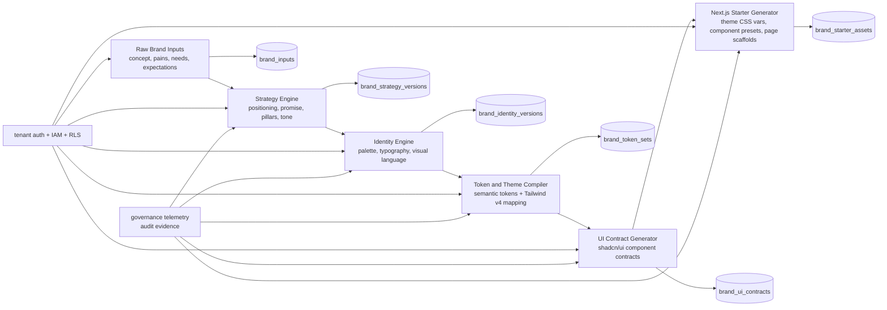

# Architecture Patterns

**Domain:** v3.4.0 Complete Branding Engine
**Researched:** 2026-04-11

## Recommended Architecture

The branding engine should be added as a tenant-scoped pipeline that extends existing MarkOS seams (`app`, `api`, `lib`, `contracts`) rather than introducing a new platform runtime. The core principle is: strategy and identity are versioned artifacts, and implementation outputs are deterministic derivatives of a published brand version.

## Integration Points

### Existing surfaces to reuse

- `app/(markos)/layout.tsx`: keep tenant-context fail-closed resolution as entry boundary.
- `lib/markos/auth/session.ts`: keep session -> active tenant context contract.
- `lib/markos/tenant/contracts.js`: keep canonical role/tenant semantics and role mapping.
- `lib/markos/theme/tokens.ts` and `lib/markos/theme/brand-pack.ts`: use as baseline token and brand-pack primitives.
- `api/*` pattern with `createRuntimeContext` + `requireHostedSupabaseAuth`: preserve local/hosted parity.
- `lib/markos/crm/api.cjs` pattern (`requireCrmTenantContext`, mutation gates): replicate for brand API handlers.
- `contracts/schema.json` + `contracts/flow-registry.json`: extend with new F-65+ flow contracts for branding engine endpoints.
- `lib/markos/plugins/telemetry.js` and governance evidence model (`lib/markos/governance/contracts.ts`): reuse immutable/sanitized telemetry and tenant configuration audit lineage.

### New API/UI integration seams

- New app route group under `app/(markos)/branding/*` for workflow screens:
  - Inputs + insight modeling
  - Strategy review/approval
  - Identity/tokens review
  - Component contract preview
  - Starter export dashboard
- New API namespace under `api/branding/*` for stepwise orchestration and publish/rollback actions.
- Server actions in `app/(markos)/branding/actions.ts` should call `api/branding/*`, matching existing plugin settings action pattern.

## New vs Modified Surfaces

### New modules

- `lib/markos/branding/contracts.ts`
  - Runtime type guards and schema assertions for:
    - `BrandInputDraft`
    - `BrandStrategyArtifact`
    - `BrandIdentityArtifact`
    - `BrandTokenSet`
    - `BrandUIContract`
    - `BrandStarterBundle`
- `lib/markos/branding/repository.ts`
  - Tenant-scoped persistence adapter (Supabase in hosted mode; deterministic fallback stubs for local tests).
- `lib/markos/branding/engine.ts`
  - Deterministic orchestration pipeline (`inputs -> strategy -> identity -> tokens -> ui-contract -> starter`).
- `lib/markos/branding/compile-tokens.ts`
  - Converts strategy/identity decisions into semantic token map compatible with `lib/markos/theme/tokens.ts`.
- `lib/markos/branding/compile-ui-contract.ts`
  - Produces shadcn/ui component contract payloads and variant/state requirements.
- `lib/markos/branding/export-next-starter.ts`
  - Emits Next.js starter assets/contracts (not deploy pipeline).
- `api/branding/inputs.js`
- `api/branding/strategy.js`
- `api/branding/identity.js`
- `api/branding/tokens.js`
- `api/branding/ui-contract.js`
- `api/branding/starter.js`
- `api/branding/publish.js`
- `api/branding/rollback.js`
- `contracts/F-65-branding-inputs-v1.yaml`
- `contracts/F-66-brand-strategy-v1.yaml`
- `contracts/F-67-brand-identity-v1.yaml`
- `contracts/F-68-brand-token-compiler-v1.yaml`
- `contracts/F-69-brand-ui-contract-v1.yaml`
- `contracts/F-70-brand-next-starter-v1.yaml`

### Existing modules to extend

- `lib/markos/theme/brand-pack.ts`
  - Extend beyond simple overrides so published token sets can be resolved by `brand_version_id` while preserving current fallback behavior.
- `lib/markos/theme/tokens.ts`
  - Keep base semantic tokens; add compiler compatibility helpers for generated token families.
- `app/(markos)/settings/theme/page.tsx`
  - Connect to published branding token/version instead of static `defaultBrandPack` only.
- `lib/markos/telemetry/events.ts`
  - Add branding event names (`markos_brand_strategy_published`, `markos_brand_tokens_compiled`, etc.).
- `lib/markos/governance/evidence-pack.ts`
  - Include branding lifecycle actions in tenant configuration evidence families.

## Data Flow: End-to-End Branding Pipeline

1. Raw brand intake
- UI captures concept, audience pains, needs, and expectations.
- `POST /api/branding/inputs` stores draft in `brand_inputs` with `tenant_id`, `created_by`, `version_state=draft`.

2. Strategy artifact generation
- `POST /api/branding/strategy` reads latest approved inputs, computes positioning/promise/pillars/tone.
- Writes append-only record to `brand_strategy_versions`.
- Optional reviewer approval gate before promotion.

3. Identity artifact generation
- `POST /api/branding/identity` derives color intent, typography hierarchy, visual principles, usage guardrails.
- Writes append-only record to `brand_identity_versions` linked to `strategy_version_id`.

4. Token compilation
- `POST /api/branding/tokens` maps identity decisions to semantic/system tokens.
- Produces:
  - canonical semantic token map
  - Tailwind v4 theme projection
  - accessibility check report
- Writes to `brand_token_sets` and references compatible `brand_pack_version` metadata.

5. UI contract generation
- `POST /api/branding/ui-contract` creates shadcn/ui-oriented component contract artifacts (variants, states, responsive and accessibility requirements).
- Writes to `brand_ui_contracts` linked to `token_set_version_id`.

6. Next.js starter asset generation
- `POST /api/branding/starter` emits starter bundle descriptors:
  - `theme.css` variable contract
  - component config map
  - page scaffold metadata
- Writes immutable metadata to `brand_starter_assets` (artifact manifest + checksum, not direct autonomous deployment).

7. Publish and activation
- `POST /api/branding/publish` marks one full chain as active for tenant.
- Theme/settings and plugin/outbound surfaces resolve active chain by `tenant_id + active_brand_version_id`.

## Persistence Strategy

### Storage model

Use append-only version tables for each stage, with explicit parent links and a tenant-scoped "active pointer".

- `brand_inputs`
- `brand_strategy_versions`
- `brand_identity_versions`
- `brand_token_sets`
- `brand_ui_contracts`
- `brand_starter_assets`
- `tenant_brand_active_version`

### Why this fits current codebase

- Matches existing immutable governance and telemetry direction.
- Supports deterministic replay/regeneration.
- Enables safe rollback by repointing active version rather than destructive edits.

### Local/hosted execution

- Hosted: Supabase-backed persistence with RLS per table (`tenant_id` mandatory).
- Local/test: in-memory or fixture-backed store adapters with same repository interface (pattern similar to `lib/markos/crm/api.cjs` shared store approach).

## Schema Boundaries

### Brand domain boundary

Branding schema should remain independent from CRM transactional tables. CRM consumes published brand outputs by reference only.

- Brand engine owns: strategy, identity, tokens, UI contracts, starter descriptors.
- CRM/outbound/plugin surfaces consume: resolved brand context/token snapshot.

### Contract boundary

Each branding endpoint gets its own contract file in `contracts/` with explicit inputs/outputs/rules, following existing per-flow contract discipline.

### UI boundary

- `app/(markos)/branding/*` surfaces authoring/review workflows.
- Existing `settings/theme` and plugin surfaces only consume published outputs and preview versions; they do not own strategy generation.

## API and UI Integration Points

### API

All branding handlers should follow current guard sequence:

1. `createRuntimeContext()`
2. `requireHostedSupabaseAuth({ operation })`
3. `requireBrandTenantContext(req)` (new helper mirroring CRM context gate)
4. role/action gate (`owner`, `tenant-admin`, `manager`, `reviewer` for approvals)
5. repository + engine operation
6. immutable telemetry append

### UI

- App router pages call server actions.
- Server actions call `api/branding/*`.
- Read surfaces resolve active brand chain and show stage-specific provenance (`published_by`, `published_at`, `schema_version`, `lineage_ids`).

## Tenancy and Governance Constraints (Must Preserve)

- Tenant isolation first:
  - Every branding row includes `tenant_id`.
  - Every query filters by tenant and is RLS-protected.
  - Cross-tenant read/review is forbidden unless explicit owner-only governance action exists (same spirit as `review_cross_tenant_copilot`).
- Fail-closed auth:
  - Missing tenant context returns explicit denial state, never default/global brand fallback for write paths.
- Role-safe mutation:
  - Draft creation allowed to contributor-class roles only if policy explicitly allows.
  - Publish/rollback requires reviewer-or-higher gate.
- Immutable lineage:
  - No in-place overwrites of published strategy/identity/token/ui-contract artifacts.
  - Rollback updates active pointer and emits evidence event.
- Telemetry + evidence:
  - Brand pipeline events sanitized through shared telemetry sanitizer.
  - Governance evidence family includes branding lifecycle actions and active-version transitions.

## Build Order

1. Brand contracts and repository foundation
- Add `lib/markos/branding/contracts.ts` and `repository.ts`.
- Add contract YAMLs `F-65` to `F-70`.

2. Inputs and strategy services
- Implement `api/branding/inputs.js` and `api/branding/strategy.js` with tenant/IAM gates.

3. Identity and token compiler
- Implement `api/branding/identity.js` and `api/branding/tokens.js`.
- Extend `lib/markos/theme/*` for compiler compatibility.

4. UI contract + starter generation
- Implement `api/branding/ui-contract.js` and `api/branding/starter.js`.
- Add `app/(markos)/branding/*` workflow screens and preview surfaces.

5. Publish/rollback activation
- Implement `api/branding/publish.js` and `api/branding/rollback.js`.
- Wire active-brand resolution into settings/theme and plugin/outbound brand-context consumers.

6. Governance and telemetry closeout
- Add event types + evidence pack extension.
- Add validation suites and regression checks.

## Validation Hooks

### Contract validation

- CI hook to validate every `contracts/F-65..F-70*.yaml` against `contracts/schema.json` constraints (or a branding-extended schema if domain enum expansion is required).

### Determinism checks

- Snapshot tests: identical input payload + model settings must produce stable strategy/identity/token outputs except declared stochastic fields.

### Accessibility checks

- Token compiler emits contrast/readability checks; fail publish when below threshold unless explicitly waived with governance event.

### Tenant isolation tests

- Integration tests for cross-tenant read/write denial on every `api/branding/*` endpoint.

### Publish/rollback safety

- Ensure publish activates one lineage chain per tenant.
- Ensure rollback only changes active pointer and leaves prior artifacts immutable.

### UI contract integrity

- Component contract snapshot tests verify required variants/states remain present for shadcn/ui baseline primitives.

## Anti-Patterns to Avoid

- Building a separate branding microservice runtime for v3.4.0.
- Storing mutable "current brand" blobs without version lineage.
- Allowing plugins/components to bypass active brand pointer and read arbitrary token overrides directly.
- Coupling branding schema into CRM write models directly.

## Recommendation

Proceed with a "Branding Domain in Place" approach: introduce a new `lib/markos/branding/*` domain and `api/branding/*` namespace, but keep auth, tenant context propagation, telemetry, governance evidence, and contract registry patterns identical to existing MarkOS architecture. This yields end-to-end branding outputs without replatforming and preserves v3.2 isolation and audit guarantees.
